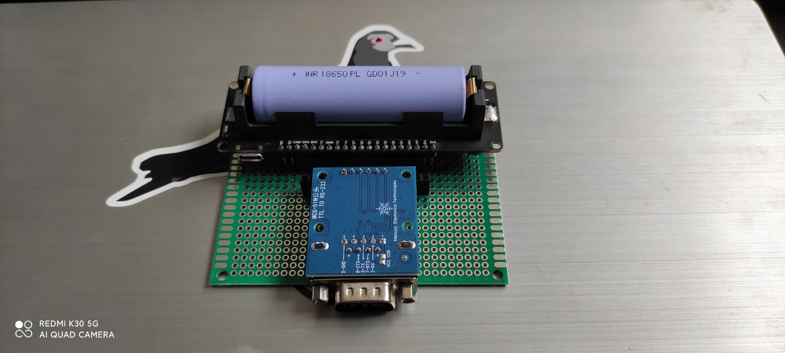
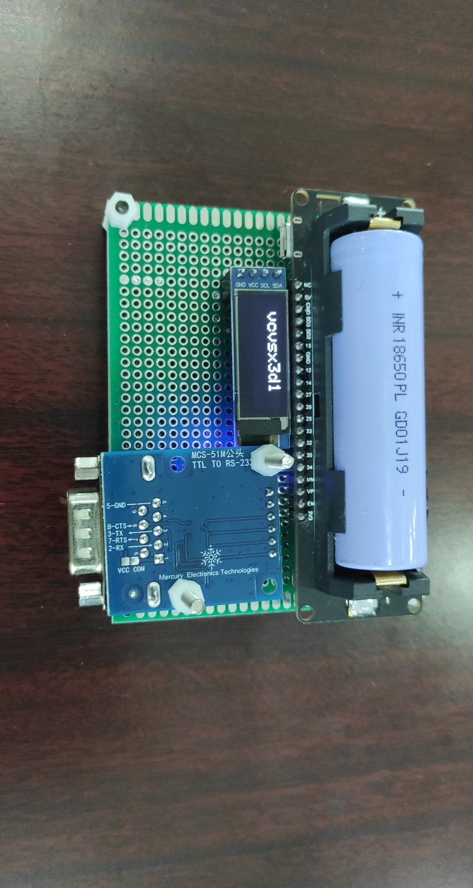
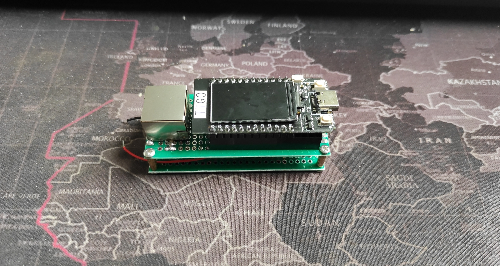
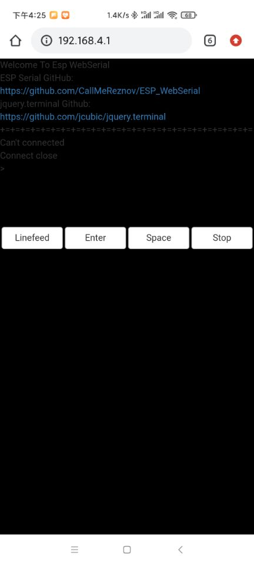

<h1 align="center">ESP_WebSerial</h1>

使用ESP32开发板制作的串口调试工具,无需客户端,支持移动端操作. 使用此工具+手机即可完成一些简单的串口调试工作,比如说交换机设备.

---

*  ProtoType 0

* ProtoType 1  
  
* ProtoType 2  

* WebGui V1.1

* WebGui V1.2

## 更新日志  
* 20210318 构思框架，完成前端demo，WS调试通过。
* 20210319 编写固件，完成WSSERVER WEBSERVER SPIFFS AP 相关基础。
* 20210322 完成串口与网页的通讯调试。  
* 20210323 解决了一些交换机交互的ASCII问题，完成V1.0。
* 20210324 随机WIFI密码，并使用OLED显示，ProtoType 1定型，固件版本v1.1  
* 20210329 更换了前端组件,更换了开发板使用TFT屏显示密码,输入使用RJ45,优化了一些操作,固件版本1.2  

## 开发环境 
开发语言 : Arduino  
开发工具 : Visual Studio 2019  Community  & Arduino IDE
### 项目组件
组件名|简介
:-|:-
Bootstrap | 网页前端框架
ESPAsyncWebServer | Esp32WebServer
ArduinoWebSockets | ESP32WebSocketServer
SPIFFS | ESP32文件系统操作用来保存页面
MCS-51M | RS-232 TTL互转模块
MCS-51B | RS-232 TTL互转MINI模块

## 使用说明
PS : 暂不提供Release固件  
使用Arduino编译固件,使用ESP32 data upload上传/data内的文件，正确连接RS-232 TO TTL模块到开发板指定针脚开机即可(代码内D5 D6定义针脚与VCC,GND)
RS232改RJ45时需保留网口3456线3与6为RX,TX,45为GND可直接并起来.

* 接线图 
   辣么简单还要接线图?????????????
## TODO 
* [x] 增加外置显示
* [x] 随机WIFI密码(WPS)
* [ ] 直接增加蓝牙串口服务器模式
* [ ] 一些字符缺失以及乱码问题(涉及到VT100控制码,现在暂时还能用就不理他了)
* [ ] 移植到8266之类的开发板上
* [ ] 集成RS-232到PCB上,直接使用网络线线路

## 相关扩展阅读

ESP32­-WROVER­-B DataSheet:  
https://www.espressif.com/sites/default/files/documentation/esp32-wrover-b_datasheet_cn.pdf

Development board :  
* ProtoType 1
https://github.com/LilyGO/LILYGO-T-Energy
* ProtoType 2
https://github.com/Xinyuan-LilyGO/TTGO-T-Display

ASCII Character Set and Hexadecimal Values :  
https://www.cisco.com/c/en/us/td/docs/ios-xml/ios/fundamentals/command/cf_command_ref/ASCII_Character_Set_and_Hexadecimal_Values.html

https://invisible-island.net/xterm/ctlseqs/ctlseqs.html#h2-VT100-Mode
https://www.gnu.org/software/screen/manual/html_node/Input-Translation.html

TTL/RS-232  
https://blog.csdn.net/zzwdkxx/article/details/7936578?_t_t_t=0.8076314434874803

ASCII CODE  
https://theasciicode.com.ar/ascii-printable-characters/capital-letter-b-uppercase-ascii-code-66.html
